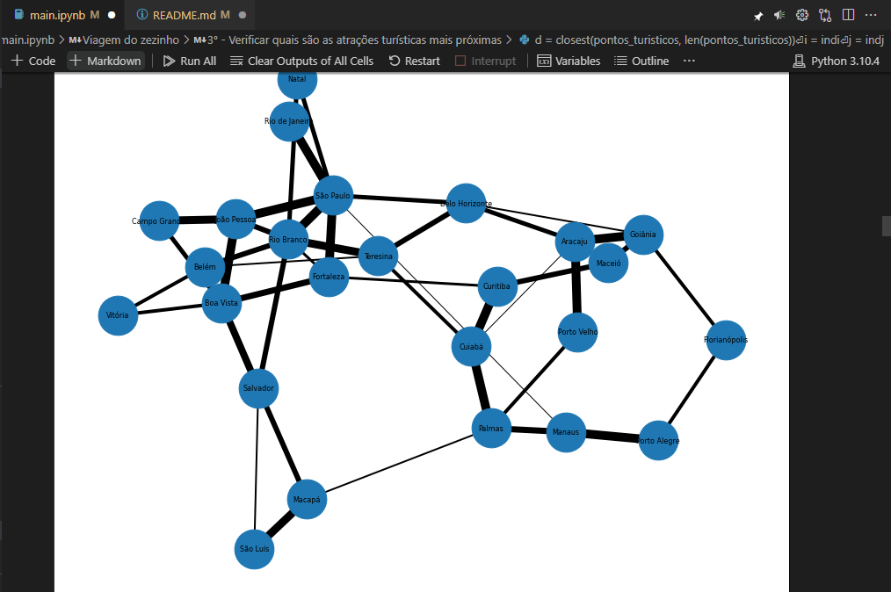
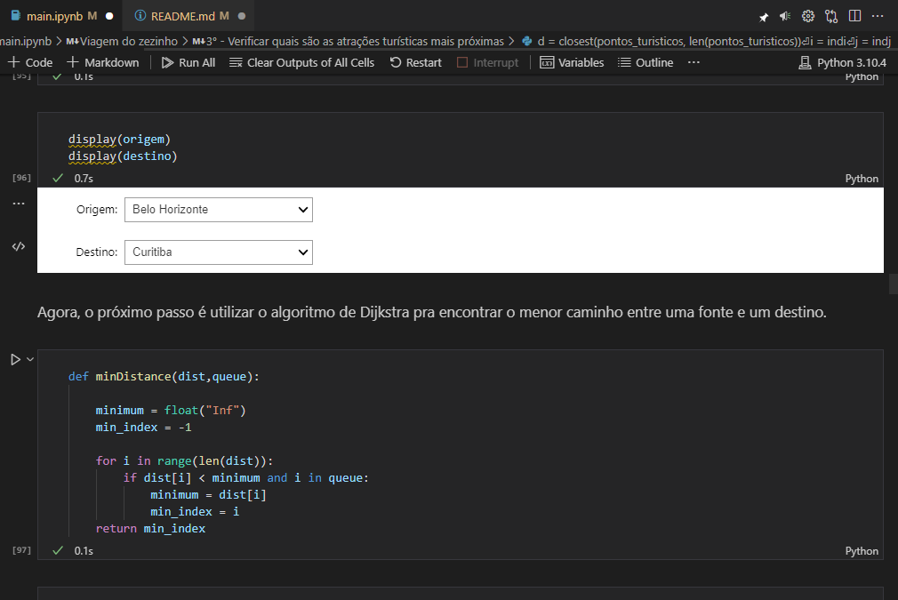
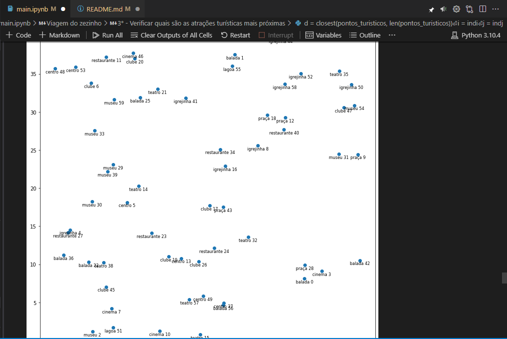

# Viagem do Zezinho

**Número da Lista**: 6<br>
**Conteúdo da Disciplina**: Final<br>

## Alunos
|Matrícula | Aluno |
| -- | -- |
| 18/0102656  |  Ítalo Vinícius |
| 18/0145088  |  Gabriel Bonifácio |

## Sobre 
O objetivo do nosso projeto é auxiliar Zezinho e sua família em uma viagem. Encontramos o menor caminho com o algoritmo de Dijkstra (Grafos 2), guardamos os brinquedos do Zezinho no cofre com o algoritmo de KnapSack (Programação Dinâmica) e identificamos os 2 pontos turísticos mais próximos para que eles visitem (Dividir e Conquistar).

### Apresentação

Para acessar a apresentação, basta acessar este link: <a href="https://youtu.be/-7OnOz_IYYA" target="_blank">https://youtu.be/-7OnOz_IYYA</a>.

Você pode baixar também a apresentação aqui no nosso repositório.

## Screenshots

<div align="center">

  

  [Figura 1: Imagem do programa](./images/img1.png)

</div>
  
<div align="center">

  
  
  [Figura 2: Imagem do programa](./images/img2.png)
  
 </div>
  
<div align="center">

  
  
  [Figura 3: Imagem do programa](./images/img3.png)
  
</div>

## Instalação 
**Linguagem**: Python<br>
**Framework**: Jupyter<br>

Siga as instruções a seguir para rodar o programa:

1) Fazer a instalação do Python, em uma versão superior a 3.6

2) Instalar as seguintes bibliotecas

```sh 
pip install jupyter-lab
pip install networkx
pip install matplotlib
pip install ipywidgets
```

3) Clonar o repositório.

```sh 
git clone https://github.com/projeto-de-algoritmos/Final_ViagemDoZezinho.git
```

4) Acessar a pasta da aplicação 

```sh 
cd Final_ViagemDoZezinho/
```

5) Executar o seguinte comando dentro da pasta clonada

```sh 
jupyter-lab
```

6) Acessar o arquivo 

```sh 
main.ipynb
```

7) Executar todas as células e visualizar os resultados.

8) Pronto. Agora, você poderá ver como foram os resultados e o que aconteceu na viagem do Zezinho! :)

## Uso 
Não há processos adicionais.

## Outros 
Não há informações adicionais.


